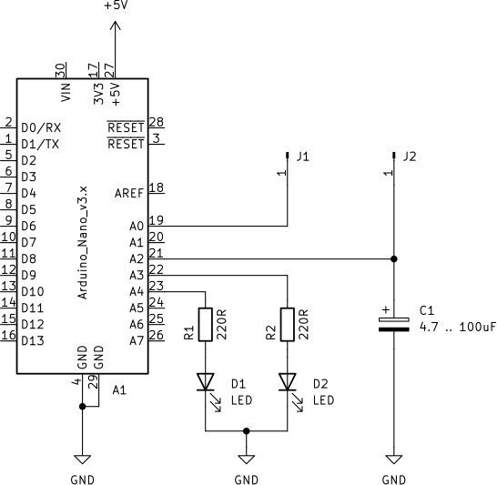

# Arduino NANO

Schematic of Charge Blinker assembled with Arduino NANO.

{#fig:blinker}

After assembling you must also program the Arduino NANO. The code
can bi found bellow or in file [ChargeBlinker.ino](./ChargeBlinker/ChargeBlinker.ino)

After program is done you are ready to go. You can connect different objects
between connectors `J1` and `J2`.

NOTE: If the frequency of LEDs blinking is not appropriate you can change the capacitor `C1`:
- use larger capacitance to have lower frequency or
- use smaller capacitance to have higer frequency.

# Code

```cpp
#define PIN_C A2
#define PIN_R A0
#define LED_1 A3
#define LED_2 A4
#define LO_TRSH 307             // 205 = cca 1V ; 512-205=307 , 717
#define HI_TRSH 717

void charge_cycle();
void discharge_cycle();

void loop() {
  charge_cycle();
  discharge_cycle();
}

void setup() {
  pinMode(PIN_C, INPUT);
  pinMode(PIN_R, OUTPUT);
  pinMode(LED_1, OUTPUT);
  pinMode(LED_2, OUTPUT);
}

void charge_cycle(){
  digitalWrite(LED_1, 1);
  digitalWrite(LED_2, 0);
  digitalWrite(PIN_R, 1);
  while (int C_ADC=analogRead(PIN_C) < HI_TRSH){}
}
void discharge_cycle(){
  digitalWrite(LED_1, 0);
  digitalWrite(LED_2, 1);
  digitalWrite(PIN_R, 0);
  while (int C_ADC=analogRead(PIN_C) > LO_TRSH ){}
}

```
: ChargeBlinker code. {#lst:ChargeBlinker}
