# SCHMITT TRIGGER INVERTER

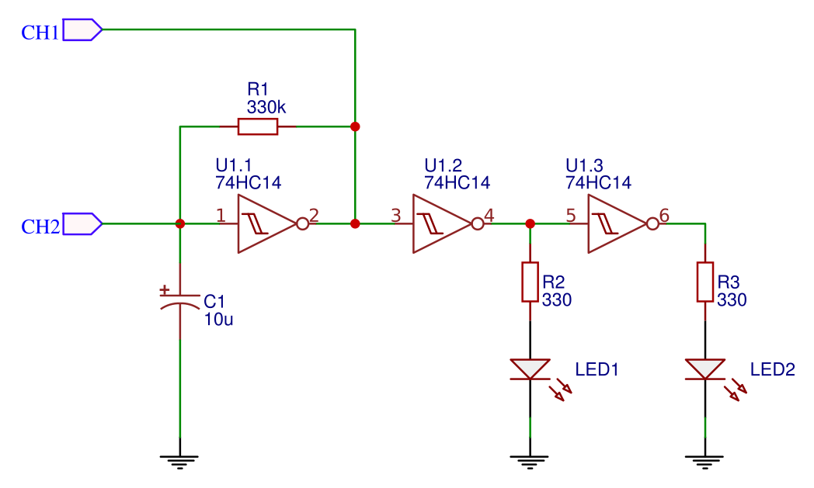

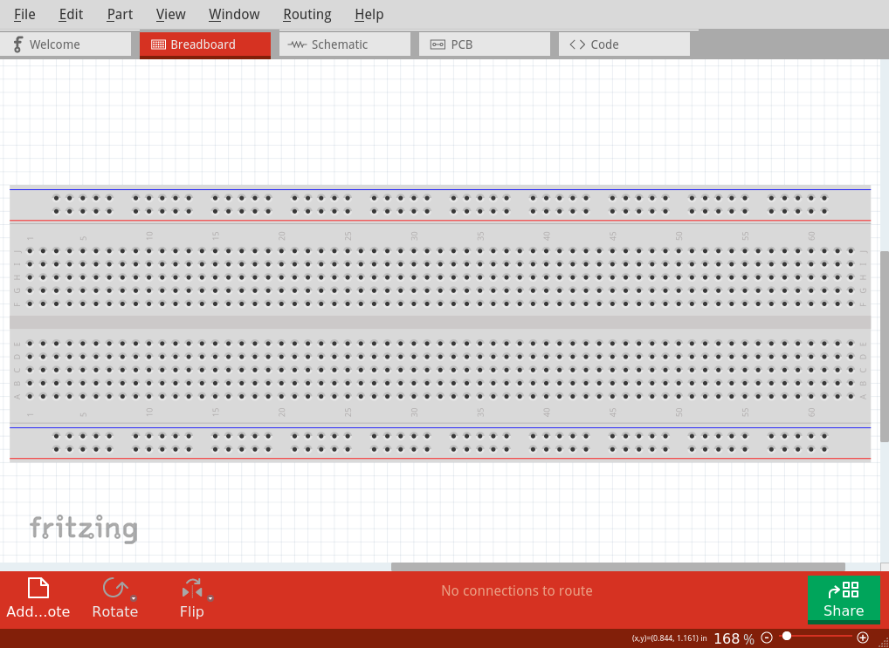{#fig:schm_trg_inv_01}
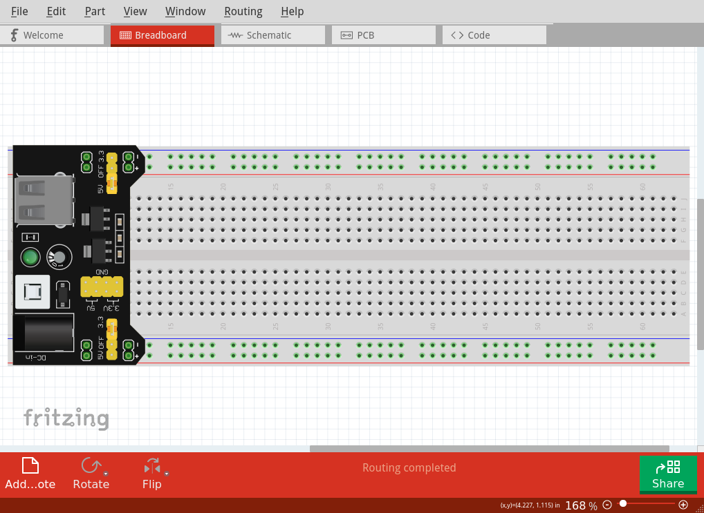{#fig:schm_trg_inv_02}
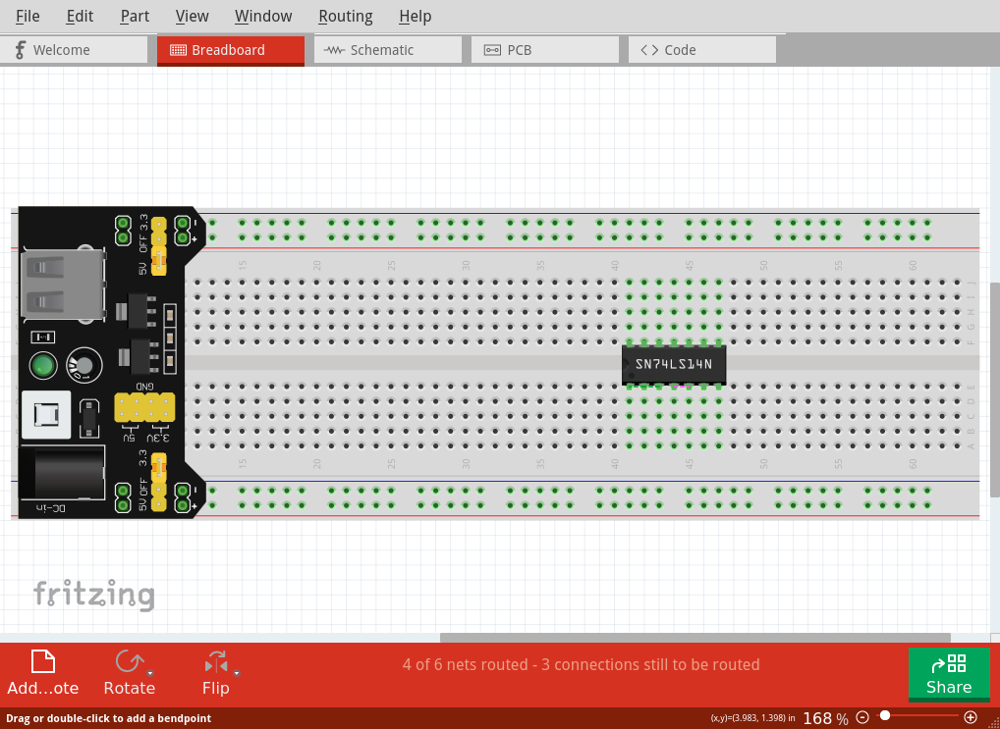{#fig:schm_trg_inv_03}
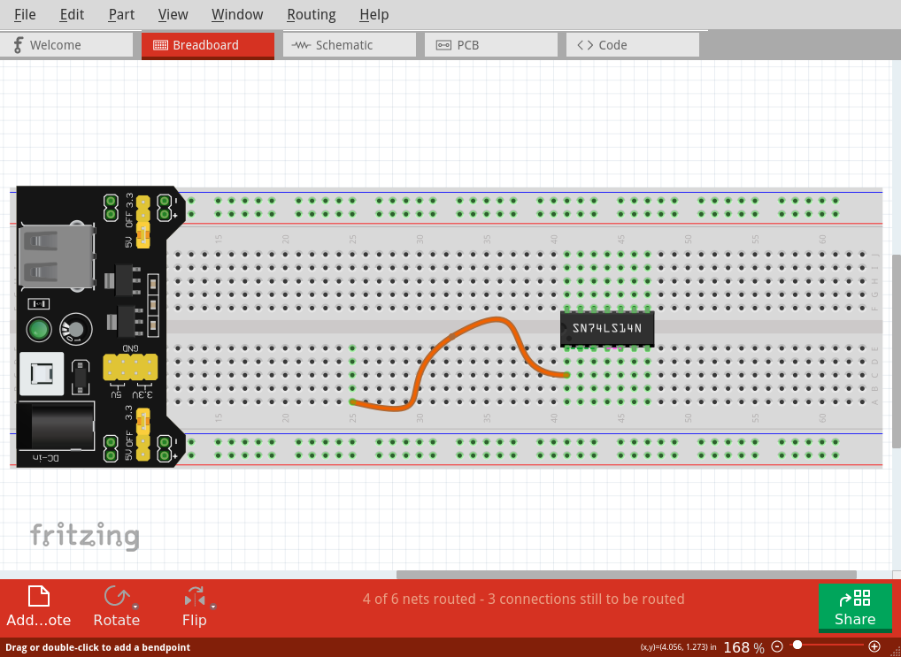{#fig:schm_trg_inv_04}
{#fig:schm_trg_inv_05}
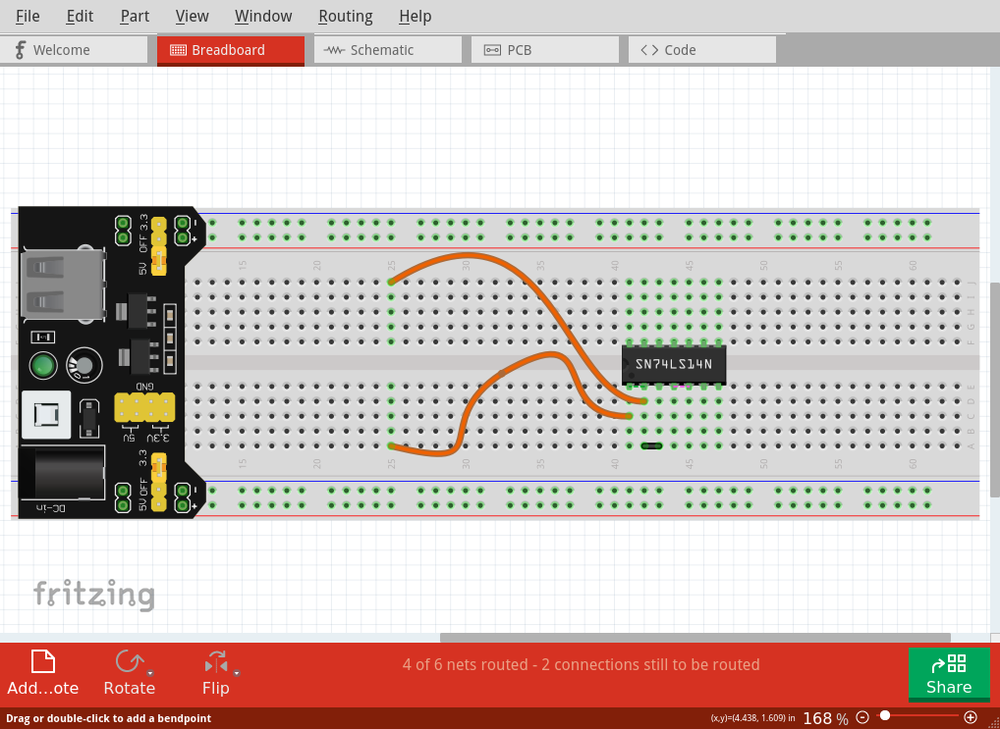{#fig:schm_trg_inv_06}
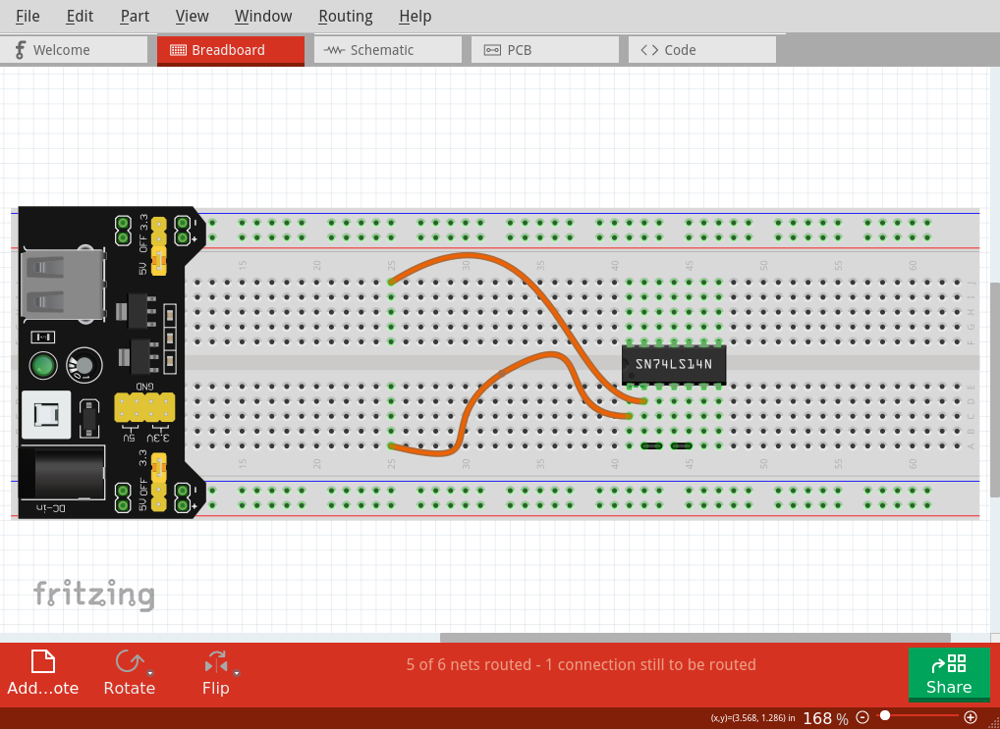{#fig:schm_trg_inv_07}
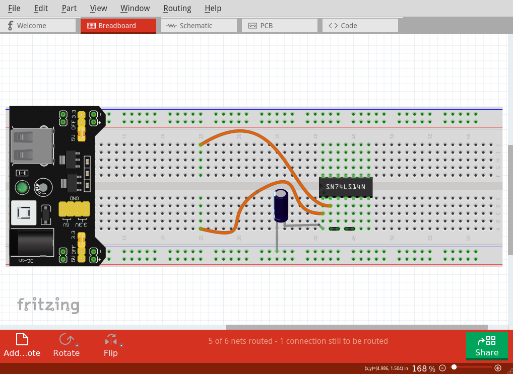{#fig:schm_trg_inv_08}
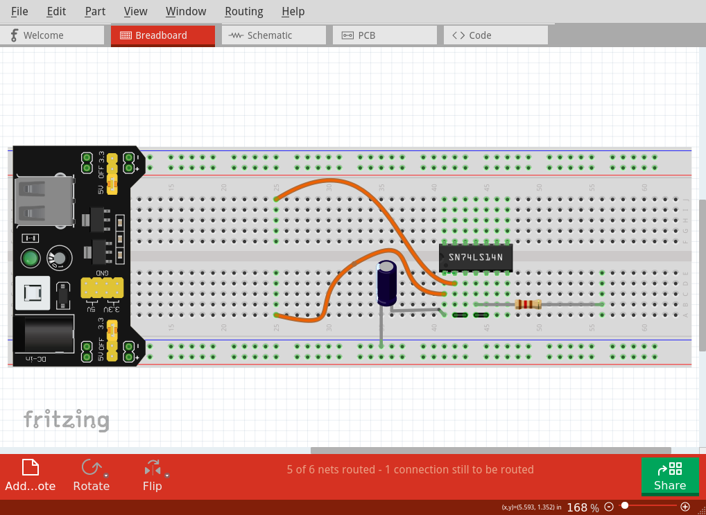{#fig:schm_trg_inv_09}
{#fig:schm_trg_inv_10}
{#fig:schm_trg_inv_11}
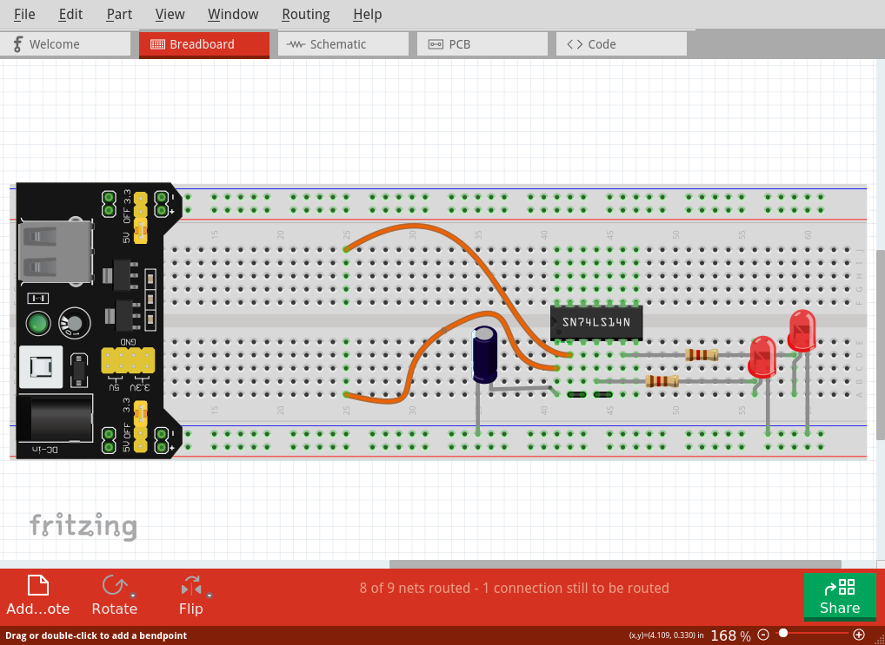{#fig:schm_trg_inv_12}
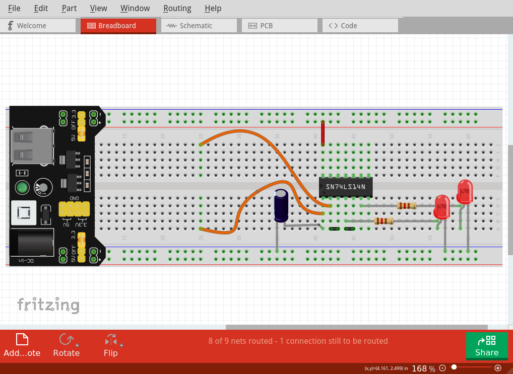{#fig:schm_trg_inv_13}
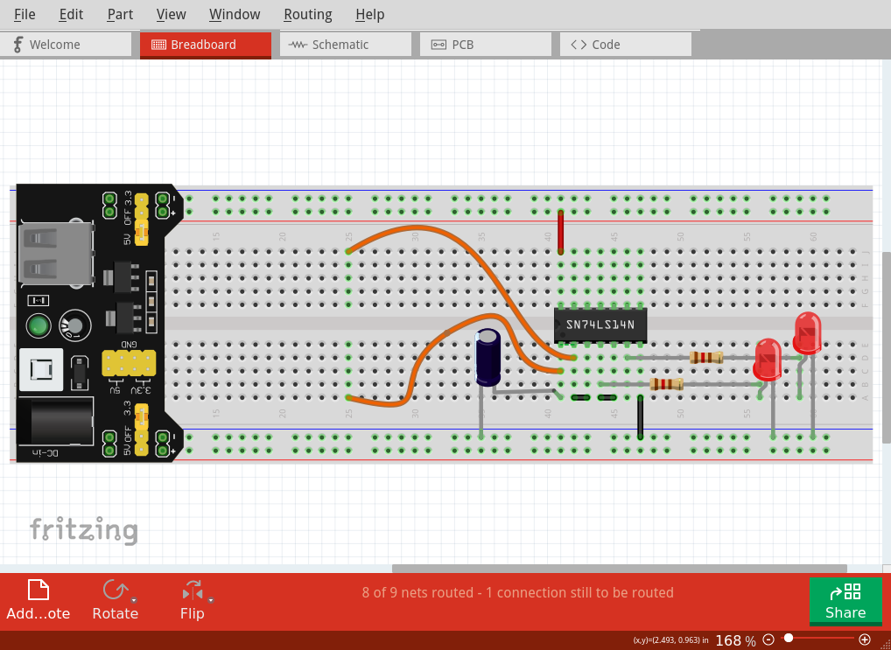{#fig:schm_trg_inv_14}
{#fig:schm_trg_inv_15}
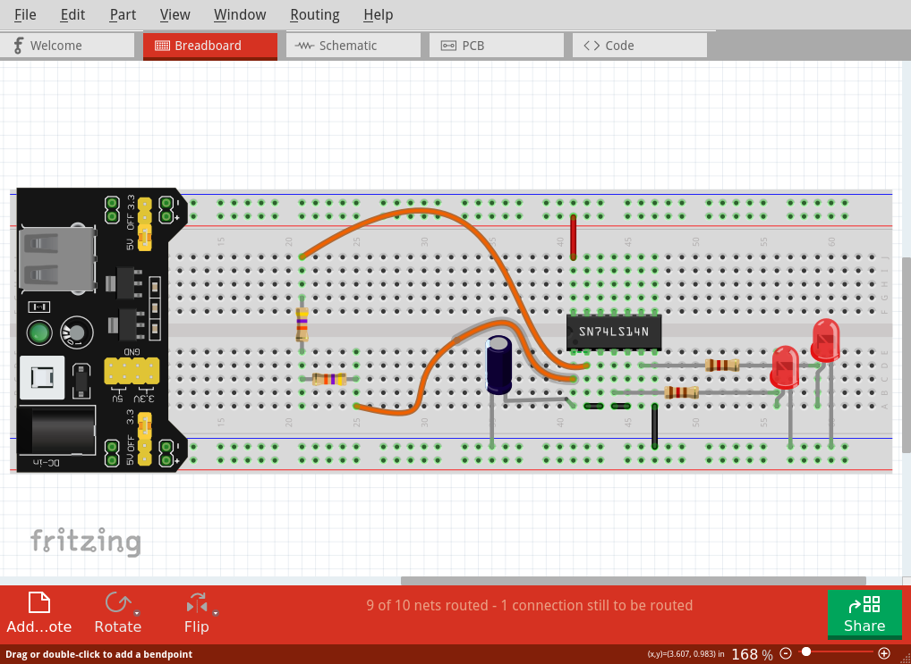{#fig:schm_trg_inv_16}
{#fig:schm_trg_inv_17}
